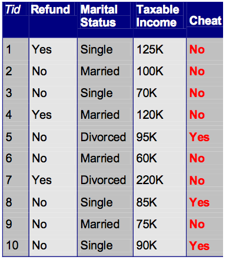

Confusion Matrix
================




A confusion matrix, also known as an error matrix, is a specific table layout that allows visualization of the performance of an algorithm, typically a supervised learning one (in unsupervised learning it is usually called a matching matrix). It's often used in machine learning and statistics to understand the performance of classification models.

In the context of binary classification, a confusion matrix typically has four quadrants:

1. **True Positives (TP):** These are the cases in which the model predicted the positive class correctly, i.e., the actual class was positive and the model also predicted the same.
2. **True Negatives (TN):** These are the cases in which the model predicted the negative class correctly, i.e., the actual class was negative and the model also predicted the same.
3. **False Positives (FP):** These are the cases in which the model incorrectly predicted the positive class, i.e., the actual class was negative but the model predicted positive. It's also known as a Type I error.
4. **False Negatives (FN):** These are the cases in which the model incorrectly predicted the negative class, i.e., the actual class was positive but the model predicted negative. It's also known as a Type II error.

The confusion matrix allows for the calculation of various performance metrics such as precision, recall, F1-score, specificity, accuracy, among others, and it's an important tool for understanding the behavior of classification models beyond simple accuracy.

---

The given Python code performs calculations related to a decision tree, particularly the computation of entropy and information gain for two attributes: 'Refund' and 'Marital Status'. It helps to identify which attribute would be a better choice to split the root node of a decision tree. The choice is based on which attribute provides the higher information gain.

Confusion Matrix Python code:

```python
import numpy as np

# Compute entropy and information gain for refund
Cheat       = -(3/10)*np.log2(3/10) - (7/10)*np.log2(7/10)
RefundYes   = -(3/3)*np.log2(4/4)   - (0/3)*np.log2(1/4)
RefundNo    = -(4/7)*np.log2(4/7)   - (3/7)*np.log2(3/7)
Gain_Refund = Cheat                 - (7/10)*RefundYes - (3/10)*RefundNo

# Compute entropy and information gain for marital status
Class_Cheat   = -(3/10)*np.log2(3/10) - (7/10)*np.log2(7/10)
Single        = -(2/4)*np.log2(2/4)   - (2/4)*np.log2(2/4)
Married       = -(0/4)*np.log2(1/5)   - (4/4)*np.log2(5/5)
Divorced      = -(1/2)*np.log2(1/2)   - (1/2)*np.log2(1/2)
Gain_Marriage = Class_Cheat           - (4/10)*Single - (4/10)*Married - (2/10)*Divorced

# Print the gains
print("Gain_Refund:   ", Gain_Refund)
print("Gain_Marriage: ", Gain_Marriage)

# Compare the gains
if Gain_Refund > Gain_Marriage:
    print("Refund should be chosen as an attribute to split the root node of a decision tree")
else:
    print("Marital status should be chosen as an attribute to split the root node of a decision tree")
```

