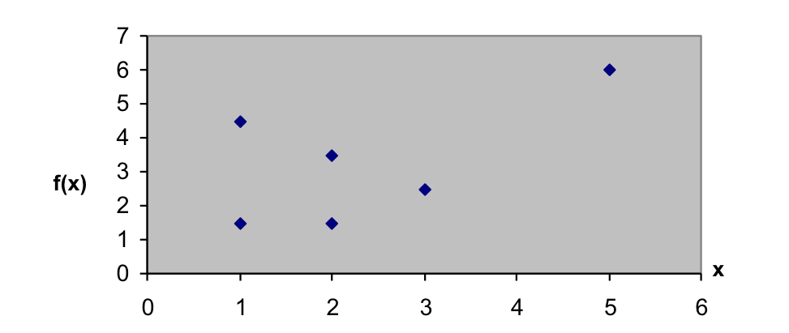

K-means Clustering
==================




**K-means clustering** is a type of unsupervised learning algorithm used in machine learning and statistics to automatically classify items into groups (or clusters) based on their inherent properties. The "K" in K-means refers to the number of clusters the algorithm is set to find.

The basic steps of the K-means algorithm are as follows:

1. **Initialization**: Choose the number of clusters, K, and initialize the cluster centroids randomly. These centroids are points in the space defined by the items to be clustered.
2. **Assignment**: Assign each item to the cluster that has the closest centroid, typically using Euclidean distance as the measure of closeness.
3. **Update**: Recalculate the positions of the centroids based on the mean of all the items in the cluster.
4. **Repeat**: Repeat the assignment and update steps until the positions of the centroids no longer change significantly or a set number of iterations has been reached.

The goal of the K-means algorithm is to minimize the variance within each cluster, or equivalently, to maximize the distance between clusters. The algorithm works well when the clusters are convex and isotropic, but its performance can degrade if clusters are of different sizes or shapes.

It's important to note that the K-means algorithm does not provide any guidance on choosing the appropriate number of clusters. There are other methods, such as the Elbow Method or Silhouette Analysis, which can help to estimate a suitable number of clusters.


---

## Python Code:

1. It defines the points in a 2D space.
2. It calculates the Euclidean distance between the first point and all other points.
3. It sets the initial cluster centers (C1 and C2) as the first and third points.
4. It calculates the Euclidean distance from all points to the two cluster centers.
5. It re-calculates the cluster centers by averaging the points assigned to each cluster. Note that this code assumes that the first three points belong to the first cluster and the remaining points belong to the second cluster. This may not be accurate in a real-world scenario where the cluster assignment would be determined based on the smaller distance to the cluster centers.


## Output
```
p1_p2: 0.0
p1_p3: 3.0
p1_p4: 1.0
p1_p5: 2.23606797749979
p1_p6: 2.23606797749979
Euclidean Distance for C1: [0.0, 3.0, 1.0, 2.23606797749979, 2.23606797749979, 6.4031242374328485]
Euclidean Distance for C2: [1.0, 3.1622776601683795, 0.0, 2.0, 1.4142135623730951, 5.830951894845301]
New C1: [1.33333333 2.5       ]
New C2: [3.33333333 4.16666667]
```
